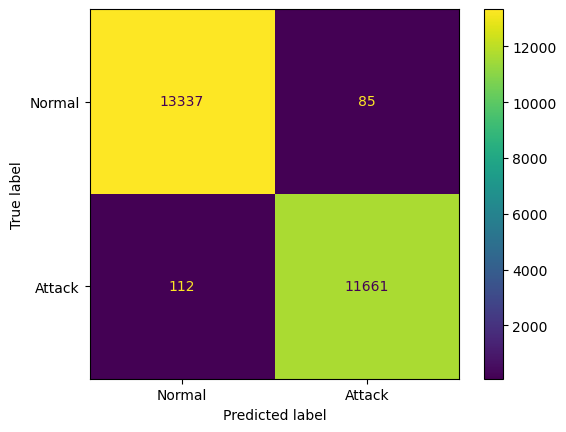
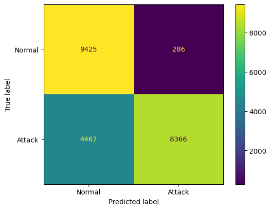
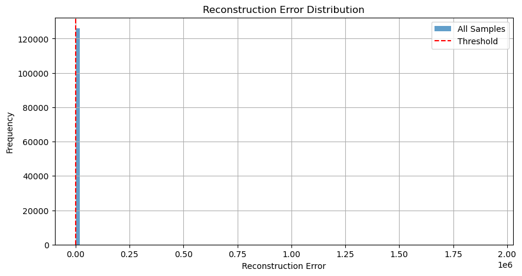
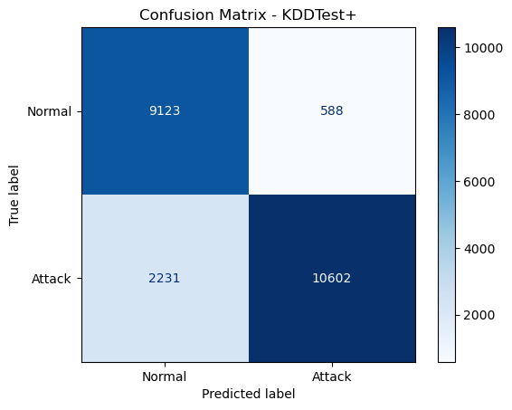
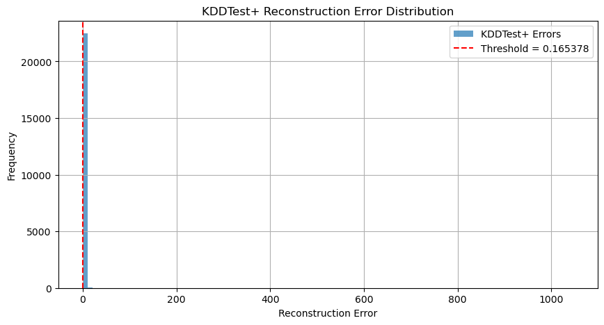
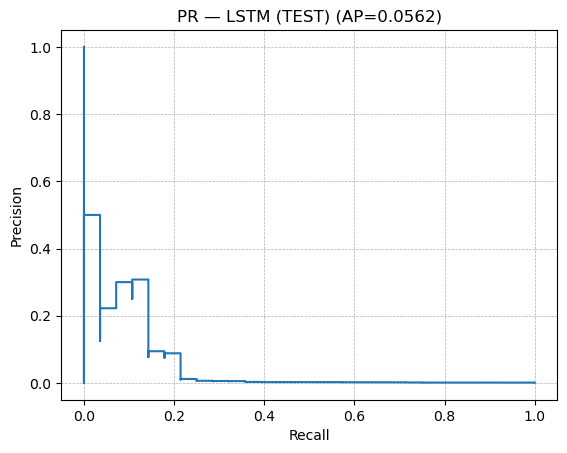
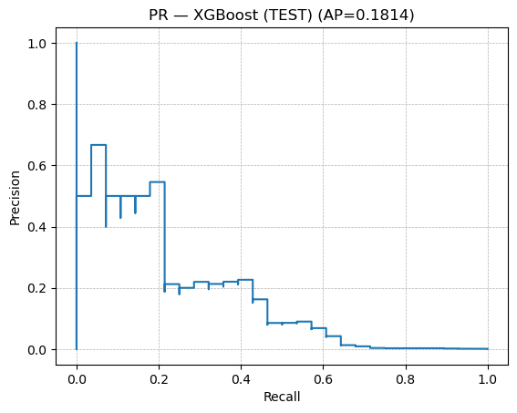
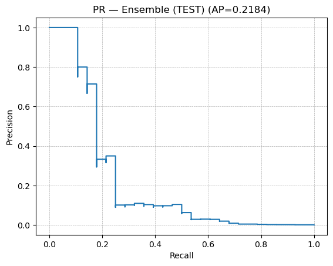

# Rocket Cognitive Environment (RocketCE)

RocketCE offers a POWER-optimized software stack for running AI workloads. It has builtin exploitation of the [AI acceleration of the Power chipset](./RocketCE/mma.md). The product aims to minimize the entry barrier for AI by natively using Python packages on Linux LPARs, without any container platform needed. Benefit from over 200 packages optimized for IBM Power and backed by enterprise support from IBM and Rocket.

**Why choose it?**

- Keep your entire AI lifecycle on premise
- Exploit AI acceleration in IBM's Power hardware
- No container orchestration platform (such as OpenShift or Kubernetes) needed
- Evaluate at no cost

**Resources**

- [Announcement](https://www.ibm.com/docs/en/announcements/rocketce-aiml-power-support?region=US)
- [Community forum](https://community.rocketsoftware.com/forums/power?CommunityKey=c7ece6e8-5a29-4a17-a2bc-68b65f89d29f)

## Sizing and configuration

AI/ML workloads are typically CPU and memory intensive, which require substantial computing resources. In addition to the amount of CPU and memory allocated to an LPAR, configuration also plays a critical role in performance optimization. These workloads can benefit from Non-Uniform Memory Access(NUMA) architecture, which allows CPUs to access local memory faster than memory located on other NUMA nodes.

The content below shows the recommended CPU, memory allocation and configurations which is based on the content from this [article](https://community.ibm.com/community/user/blogs/sebastian-lehrig/2024/03/26/sizing-for-ai). Please refer to it for more details.

### Optimal Core Configuration by System

Given NUMA, the optimal configuration for cores would be 12 or 15 core SCMs (E1080), a 24 core DCM (E1050/S1024/L1024) is the second best option, followed by a 20 core DCM (S1022/L1022), and eventually 8 core eSCMs.

|System            |Module                                         |Core per Chip|
|------------------|-----------------------------------------------|-------------|
|E1080             |12 or 15 core SCMs(both perform similarly well)|12 or 15     |
|E1050/S1024/L1024 |24 core DCMs                                   |12           |
|S1022/L1022       |20 core DCMs                                   |10           |
|S1022s            |8 core eSCMs                                   |8            |

### NUMA Setup

The performance of AI workloads can be significantly affected by NUMA affinity. To optimize memory bandwidth and maximize performance, consider the following practices:

1. Confirm the P10 module (e.g., a 2x12 core DCM means that there are 2 DCMs with 12/2=6 cores per chip).
2. Setup an LPAR that allocates the max. number of cores available on the chip (so if you have 12 cores on the socket with a DCM, allocate 6 dedicated cores to the LPAR). This LPAR then corresponds to a so-called "NUMA node" and can access local memory fast.
3. Configure the LPAR as dedicated (and not shared) via the HMC.
4. Enable Power Mode in HMC (for full frequency exploitation).
5. Set SMT to 2 (but eventually try experimenting with 4 and 8).
6. (Re)start the system, ensuring that the LPAR from step 2 is started first, followed by the other LPARs. VIO servers typically do not cause conflicts in this order. Starting the target LPAR first helps ensure that it receives cores from a single chip, improving performance.

It's also recommended to perform the memory optimizations using command `optmem` in HMC to optimize the placement of LPAR to maximize the processor-memory affinity. Here are the commands for it:

1. Get the actual score of affinity of the LPAR, the score is a number between 0 and 100, with 0 representing the worst affinity and 100 representing perfect affinity.

    ```bash
    lsmemopt -m <system_name> -o currscore -r lpar --filter lpar_names=<lpar_name>

    ```

2. Calculate and list the potential partition affinity score after the memory optimization operation.

    ```bash
    lsmemopt -m <system_name> -o calcscore -r lpar -p <lpar_name>
    ```

3. Start a Dynamic Platform Optimization operation that prioritizes the specified LPAR.

    ```bash
    optmem -m <system_name> -o start -t affinity --id <lpar_id>
    ```

    > [!NOTE]
    > When using command optmem, the affinity score of other LPARs on the same system could be either positively or negatively impacted by the optimization.

4. Check the progress of the optimization. When it's complete, reboot the LPAR to apply the changes.

    ```bash
    lsmemopt -m <system_name>
    ```

5. Check if memory optimization works using command `lscpu` or `numactl -H`. Ideally you have only 1 NUMA node - only NUMA node0 - with its assigned CPUs. Below is the result of my own LPAR, it shows that there is only one NUMA node after optimization, compared to two nodes prior to the optimization.

    ```bash
    > numactl -H
    available: 1 nodes (7)
    node 7 cpus: 0 1 2 3 4 5 6 7 8 9 10 11 12 13 14 15 16 17 18 19 20 21 22 23 24 25 26 27 28 29 30 31
    node 7 size: 95948 MB
    node 7 free: 94391 MB
    node distances:
    node 7
    7:   10
    ```

### System Memory

Memory should be sufficient for your intended workloads. Working with large language models (LLMs) typically requires around 80 GB of memory for a model with 20B parameters. To accommodate such demands, I often size LPARs with 256 GB of memory. Additionally, to maximize memory bandwidth, it’s important to populate all available memory slots with DIMMs—using several smaller DIMMs is preferable to a single large one.

### Storage

For running demos and POCs, 1 TB of disk space is typically more than sufficient.

## Installation

### Requirements

- Power9, and later, technology-based servers, with or without GPU
- Red Hat Enterprise Linux 9.0, or later
- Packages and binaries from the RocketCE channel

### Installation Guide

The binaries and packages optimized for IBM Power architecture are available in [RocketCE](https://anaconda.org/rocketce) channel. It is recommended to use Mamba instead of Conda to manage and resolve the packages, as Mamba is typically faster and can significantly reduce installation times, especially in large environments.

1. Run the commands below to install micromamba  

    ```bash
    dnf install bzip2 libxcrypt-compat vim -y
    "${SHELL}" <(curl -L micro.mamba.pm/install.sh)
    source ${HOME}/.bashrc
    ```

    An environment is a directory that contains a specific collection of Conda/Mamba packages that you have installed. You can use different environments for different projects or tasks. If you change one environment, your other environments are not affected. There is a default environment called `base` that include a Python installation and some core system libraries and dependencies of Conda/Mamba. It's recommended to avoid installing additional packages into the base environment. Additional packages needed for a new project should always be installed into a newly created Conda environment.

    The commands below are used to create new environment, activate or deactivate environments.

    ```bash
    micromamba create -n myenv python=3.10 numpy pandas
    micromamba activate myenv
    micromamba deactivate myenv
    ```

    Please refer to the [Mamba documentation](https://mamba.readthedocs.io/en/latest/index.html) for more details.

2. Configure micromamba to use RocketCE

    ```bash
    cat > ~/.condarc <<'EOF'
    # Conda configuration see https://conda.io/projects/conda/en/latest/configuration.html
    auto_update_conda: false
    show_channel_urls: true
    channel_priority: flexible
    channels:
    - rocketce
    - defaults
    EOF
    ```

    > [!WARNING]
    > Adding Anaconda's defaults channel to above configuration requires an Anaconda license if you use it in a commercial context.

3. Install packages

    Those Python packages optimized for Power can be installed using micromamba command. Make sure you create a new environment to install these packages when you start a new project.  
    The command below is an example of how to install Python, PyTorch, and other packages using micromamba.

    ```bash
    micromamba install --yes python=3.10 pytorch-cpu mamba conda pip
    ```

    For packages that are not available in `defaults` and `RocketCE` channels, you can try installing them from `conda-forge` channel.

    ```bash
    micromamba install --yes 'conda-forge::accelerate'
    ```

    > [!INFO]
    > the conda-forge channel includes community-build packages; whereas the defaults and rocketce channels provide enterprise-grade builds and support.

    For packages that are not available in any Conda channels, you can choose to use `pip` to install them. But try to minimize using `pip` where possible as to keep your Conda environment clean and well-managed. You can preconfigure pip to use pre-build Python wheels from a repository by Power champion `Marvin Gießing` who precompiled some useful wheels, which speeds up package installations.

    - Optional: configure pip with Marvin's repos (recommended for rapid testing):

    ```bash
    mkdir ~/.pip && \
    echo "[global]" >> ~/.pip/pip.conf && \
    echo "extra-index-url = https://repo.fury.io/mgiessing" >> ~/.pip/pip.conf
    ```

    - Install pre-requisites from conda channels (in this example, these are needed for librosa):

    ```bash
    micromamba install --yes 'conda-forge::msgpack-python' 'conda-forge::soxr-python'
    ```

    - Install packages:

    ```pip install --prefer-binary \
    "librosa" \
    "openai-whisper"
    ```

4. Use JupyterLab

    JupyterLab is included in the RocketCE and it's the latest web-based interactive development environment for notebooks, code, and data.

    - Install JupyterLab

    ```bash
    mamba install --yes jupyterlab
    ```

    - Start JupyterLab

    ```bash
    mkdir notebooks
    nohup jupyter lab --notebook-dir=${HOME}/notebooks --ip=0.0.0.0 --no-browser --allow-root --port=8888 --NotebookApp.allow_origin='*' --NotebookApp.token='' --NotebookApp.password='' &
    ```

    - Access JupyterLab using the URL: `http://<server>:8888/lab`

    The command used above to start JupyterLab does not specify a user password and uses HTTP for client-server communication. If you want to set a password and configure TLS/SSL for secure access, please refer to [Jupyter documentation](https://jupyter-server.readthedocs.io/en/latest/operators/public-server.html#jupyter-public-server).

    > [!WARNING]
    > If the firewall on the server is running, make sure it's configured to allow connections from client machines to access the port specified in the command above.

## Sample applications

### Intrusion Detection
With on-prem inferecing, deploying an intrusion detection system based on AI ob the IBM i system is an easy endeavor. Here, we train and compare two AI frameworks for intrusion detection, one that uses a neural network based system, particularly an multi-layer feed forward perceptron (MLP) which uses supervised learning, versus an unsupervised approach that uses an autoencoder deep learning framework. Both frameworks are trained and tested on the NSL-KDD dataset, with balanced classes for normal and attack vectors, and 43 different features to describe each tuple. Both the train and test samples can be downloaded using:

```bash
wget https://raw.githubusercontent.com/defcom17/NSL_KDD/master/KDDTrain+.txt
wget https://raw.githubusercontent.com/defcom17/NSL_KDD/master/KDDTest+.txt
```

#### Multilayer Perceptron/MLP

An MLP is a fully connected feed-forward neural network, with an architecture that consists of linear layers, activation functions, loss functions and optimizers. The output is computed based on weights in the linear layers on the forward pass, where losses are calculated depending on the prediction, and then a backward pass is used to compute loss function derivatives, and then updated with the optimizer. This process continues throughout the training phase for the final model.

Here the necessary libraries are imported for the model.


```python
import pandas as pd
import numpy as np
import torch
import torch.nn as nn
from torch.utils.data import Dataset, DataLoader
from sklearn.preprocessing import LabelEncoder, StandardScaler
from sklearn.model_selection import train_test_split
from sklearn.metrics import accuracy_score
```

The KDDTrain and KDDTest samples are downloaded.


```python
!wget https://raw.githubusercontent.com/defcom17/NSL_KDD/master/KDDTrain+.txt
```

    --2025-06-10 16:53:44--  https://raw.githubusercontent.com/defcom17/NSL_KDD/master/KDDTrain+.txt
    Resolving raw.githubusercontent.com (raw.githubusercontent.com)... 185.199.109.133, 185.199.110.133, 185.199.108.133, ...
    Connecting to raw.githubusercontent.com (raw.githubusercontent.com)|185.199.109.133|:443... connected.
    HTTP request sent, awaiting response... 200 OK
    Length: 19109424 (18M) [text/plain]
    Saving to: ‘KDDTrain+.txt’
    
    KDDTrain+.txt       100%[===================>]  18.22M  37.4MB/s    in 0.5s    
    
    2025-06-10 16:53:46 (37.4 MB/s) - ‘KDDTrain+.txt’ saved [19109424/19109424]
    


```python
!wget https://raw.githubusercontent.com/defcom17/NSL_KDD/master/KDDTest+.txt
```

    --2025-06-10 16:53:48--  https://raw.githubusercontent.com/defcom17/NSL_KDD/master/KDDTest+.txt
    Resolving raw.githubusercontent.com (raw.githubusercontent.com)... 185.199.110.133, 185.199.109.133, 185.199.108.133, ...
    Connecting to raw.githubusercontent.com (raw.githubusercontent.com)|185.199.110.133|:443... connected.
    HTTP request sent, awaiting response... 200 OK
    Length: 3441513 (3.3M) [text/plain]
    Saving to: ‘KDDTest+.txt’
    
    KDDTest+.txt        100%[===================>]   3.28M  13.1MB/s    in 0.3s    
    
    2025-06-10 16:53:49 (13.1 MB/s) - ‘KDDTest+.txt’ saved [3441513/3441513]
    


Column names for the features, label and difficulty from the KDD Dataset are enumerated, and the data loaded from the CSV


```python
cols = [f'feature_{i}' for i in range(41)] + ['label', 'difficulty']
df = pd.read_csv("KDDTrain+.txt", header=None, names=cols)
```

The data is encoded, labels specified (there are numberous attack labels in the KDD Dataset, they are all classified under one label), and the features normalized. The data is then split into train and evaluation splits.


```python
# Encode categorical
for col in ['feature_1', 'feature_2', 'feature_3']:
    df[col] = LabelEncoder().fit_transform(df[col])

# Binary label: 0 = normal, 1 = attack
df['label'] = df['label'].apply(lambda x: 0 if x == 'normal' else 1)

# Normalize features
X = df.iloc[:, :-2].values
y = df['label'].values
X = StandardScaler().fit_transform(X)

# Split
X_train, X_val, y_train, y_val = train_test_split(X, y, test_size=0.2, random_state=42)
```

This is where the Dataset is preprocessed before feeding to the model, by creating tensors, and after that the IDS model architecture is defined, with 3 Linear layers and 2 Rectified Linear Unit (ReLU) layers in-between each.


```python
class IntrusionDataset(Dataset):
    def __init__(self, X, y):
        self.X = torch.tensor(X, dtype=torch.float32)
        self.y = torch.tensor(y, dtype=torch.float32)
    def __len__(self):
        return len(self.y)
    def __getitem__(self, idx):
        return self.X[idx], self.y[idx]

train_loader = DataLoader(IntrusionDataset(X_train, y_train), batch_size=64, shuffle=True)
val_loader = DataLoader(IntrusionDataset(X_val, y_val), batch_size=64)
```


```python
class SimpleIDSModel(nn.Module):
    def __init__(self, input_size):
        super(SimpleIDSModel, self).__init__()
        self.net = nn.Sequential(
            nn.Linear(input_size, 64),
            nn.ReLU(),
            nn.Linear(64, 32),
            nn.ReLU(),
            nn.Linear(32, 1)  # No sigmoid
        )
    def forward(self, x):
        return self.net(x)
```

Model is trained with the various hyperparameters such as the criterion (loss function) and the optimizer. Epochs are the number of times the model goes through the training loop. Decreasing loss for each epoch means the model is learning, and more epochs may lead to better performance at the cost of training resources.


```python
model = SimpleIDSModel(X.shape[1])
criterion = nn.BCEWithLogitsLoss()
optimizer = torch.optim.Adam(model.parameters(), lr=0.0001)

num_epochs = 20

for epoch in range(num_epochs):
    model.train()
    epoch_loss = 0.0
    
    for i, (X_batch, y_batch) in enumerate(train_loader):
        optimizer.zero_grad()
        
        # Forward pass (logits only)
        logits = model(X_batch).view(-1)
        loss = criterion(logits, y_batch)
        
        # Backward pass
        loss.backward()
        torch.nn.utils.clip_grad_norm_(model.parameters(), max_norm=1.0)  # optional
        optimizer.step()
        
        epoch_loss += loss.item()
        
        # Output monitoring for first batch in each epoch
        if i == 0:
            with torch.no_grad():
                probs = torch.sigmoid(logits)
                print(f"\nEpoch {epoch+1}")
                print("  Logits:", logits[:5].numpy())
                print("  Probabilities:", probs[:5].numpy())
                print("  Targets:", y_batch[:5].numpy())
    
    print(f"Epoch {epoch+1} Loss: {epoch_loss:.4f}")
```

    
    Epoch 1
      Logits: [-0.09146228 -0.17194918 -0.16620973 -0.1687215  -0.10673405]
      Probabilities: [0.47715032 0.4571183  0.45854297 0.4579194  0.47334176]
      Targets: [1. 0. 0. 0. 1.]
    Epoch 1 Loss: 351.0091
    
    Epoch 2
      Logits: [-1.992386   6.0422745 -4.584759  -3.7289672 -4.790593 ]
      Probabilities: [0.12000466 0.99762946 0.01010309 0.02345431 0.00823908]
      Targets: [1. 1. 0. 0. 0.]
    Epoch 2 Loss: 127.9977
    
    Epoch 3
      Logits: [ 6.911761   -0.96739316  4.5789156   4.548613    3.0381422 ]
      Probabilities: [0.999005   0.2754004  0.98983824 0.98952895 0.95426786]
      Targets: [1. 0. 1. 1. 1.]
    Epoch 3 Loss: 95.3207
    
    Epoch 4
      Logits: [-5.6969457 -4.7877383 -5.778388  -5.5837092  7.5258374]
      Probabilities: [0.00334497 0.00826244 0.00308416 0.00374452 0.99946135]
      Targets: [0. 0. 0. 0. 1.]
    Epoch 4 Loss: 72.6620
    
    Epoch 5
      Logits: [-6.0059843 13.65903   -5.0342255 -6.4327526 10.449551 ]
      Probabilities: [0.00245791 0.9999988  0.00646912 0.00160544 0.99997103]
      Targets: [0. 1. 0. 0. 1.]
    Epoch 5 Loss: 59.6291
    
    Epoch 6
      Logits: [ -5.6283956 -10.749986    8.462506   11.078273   -7.4283724]
      Probabilities: [3.5814645e-03 2.1445256e-05 9.9978882e-01 9.9998450e-01 5.9380097e-04]
      Targets: [0. 0. 1. 1. 0.]
    Epoch 6 Loss: 52.0563
    
    Epoch 7
      Logits: [-6.1015778 11.520893  11.554005  10.352732  -6.8339925]
      Probabilities: [0.00223433 0.9999901  0.99999034 0.99996805 0.00107539]
      Targets: [0. 1. 1. 1. 0.]
    Epoch 7 Loss: 47.3041
    
    Epoch 8
      Logits: [ 8.413296  -9.12116   -5.695891  -4.9592686 -9.389942 ]
      Probabilities: [9.9977821e-01 1.0931588e-04 3.3484926e-03 6.9691497e-03 8.3553306e-05]
      Targets: [1. 0. 0. 0. 0.]
    Epoch 8 Loss: 43.9304
    
    Epoch 9
      Logits: [ 7.702268  -9.752635  -9.433811   8.834523  -7.9970593]
      Probabilities: [9.9954838e-01 5.8137877e-05 7.9967424e-05 9.9985433e-01 3.3633737e-04]
      Targets: [1. 0. 0. 1. 0.]
    Epoch 9 Loss: 41.0687
    
    Epoch 10
      Logits: [ 9.179084 10.527233 21.593142  8.310046  8.564558]
      Probabilities: [0.9998969 0.9999732 1.        0.999754  0.9998093]
      Targets: [1. 1. 1. 1. 1.]
    Epoch 10 Loss: 38.8511
    
    Epoch 11
      Logits: [ -7.450081 -12.375889  12.016492   9.549978  13.666914]
      Probabilities: [5.8105681e-04 4.2190818e-06 9.9999392e-01 9.9992883e-01 9.9999881e-01]
      Targets: [0. 0. 1. 1. 1.]
    Epoch 11 Loss: 37.4427
    
    Epoch 12
      Logits: [  0.7380047  -9.400427   10.752464  -11.815881   -6.3663497]
      Probabilities: [6.7655933e-01 8.2681923e-05 9.9997866e-01 7.3862666e-06 1.7154726e-03]
      Targets: [1. 0. 1. 0. 0.]
    Epoch 12 Loss: 35.7199
    
    Epoch 13
      Logits: [-16.691273   8.068301  -8.301234  13.128547  -4.831968]
      Probabilities: [5.6373153e-08 9.9968684e-01 2.4814869e-04 9.9999797e-01 7.9077892e-03]
      Targets: [0. 1. 0. 1. 0.]
    Epoch 13 Loss: 34.7277
    
    Epoch 14
      Logits: [ -7.8866506  -7.002042  -14.27597     9.264672   14.00633  ]
      Probabilities: [3.7558482e-04 9.0919464e-04 6.3099299e-07 9.9990535e-01 9.9999917e-01]
      Targets: [0. 0. 0. 1. 1.]
    Epoch 14 Loss: 33.5672
    
    Epoch 15
      Logits: [  6.335084   -9.381743  -10.329523   -9.518926   -5.3321953]
      Probabilities: [9.9823016e-01 8.4241088e-05 3.2653592e-05 7.3443138e-05 4.8101977e-03]
      Targets: [1. 0. 0. 0. 0.]
    Epoch 15 Loss: 32.6898
    
    Epoch 16
      Logits: [-9.922427 12.140923  9.988167  9.508379 -9.399144]
      Probabilities: [4.9059523e-05 9.9999464e-01 9.9995410e-01 9.9992573e-01 8.2788043e-05]
      Targets: [0. 1. 1. 1. 0.]
    Epoch 16 Loss: 31.8510
    
    Epoch 17
      Logits: [ 12.138786   -8.219288   10.727863  -12.77737     7.9523435]
      Probabilities: [9.9999464e-01 2.6933430e-04 9.9997807e-01 2.8239519e-06 9.9964833e-01]
      Targets: [1. 0. 1. 0. 1.]
    Epoch 17 Loss: 31.2835
    
    Epoch 18
      Logits: [ 14.749927 -12.818765  12.938683 -11.881991  -7.97953 ]
      Probabilities: [9.9999964e-01 2.7094434e-06 9.9999762e-01 6.9137504e-06 3.4228317e-04]
      Targets: [1. 0. 1. 0. 0.]
    Epoch 18 Loss: 30.6485
    
    Epoch 19
      Logits: [-13.378277 -15.057227 -12.840031  -9.703639  12.201403]
      Probabilities: [1.5484156e-06 2.8888780e-07 2.6524328e-06 6.1057159e-05 9.9999499e-01]
      Targets: [0. 0. 0. 0. 1.]
    Epoch 19 Loss: 30.1179
    
    Epoch 20
      Logits: [ -9.442284  -10.361995    4.589671   -6.6981816  15.36125  ]
      Probabilities: [7.9292826e-05 3.1610336e-05 9.8994595e-01 1.2316334e-03 9.9999976e-01]
      Targets: [0. 0. 1. 0. 1.]
    Epoch 20 Loss: 29.2303


Here the model is evaluated, and scores are calculated. The model shows a 99% accuracy for the training data. 


```python
model.eval()
y_preds, y_trues = [], []

with torch.no_grad():
    for X_batch, y_batch in val_loader:
        logits = model(X_batch).view(-1)
        probs = torch.sigmoid(logits)
        preds = (probs > 0.5).int()
        
        y_preds.extend(preds.numpy())
        y_trues.extend(y_batch.int().numpy())

from sklearn.metrics import classification_report
print(classification_report(y_trues, y_preds))
```

                  precision    recall  f1-score   support
    
               0       0.99      0.99      0.99     13422
               1       0.99      0.99      0.99     11773
    
        accuracy                           0.99     25195
       macro avg       0.99      0.99      0.99     25195
    weighted avg       0.99      0.99      0.99     25195
    


Confusion matrix showing a pretty low number of false positives and negatives.


```python
from sklearn.metrics import confusion_matrix, ConfusionMatrixDisplay
cm = confusion_matrix(y_trues, y_preds)
ConfusionMatrixDisplay(cm, display_labels=['Normal', 'Attack']).plot()
```


    <sklearn.metrics._plot.confusion_matrix.ConfusionMatrixDisplay at 0x7ffec0979150>


    

    


The model is saved for deployment.


```python
torch.save(model.state_dict(), "intrusion_detection_model.pth")
```

The model appears to run great on known data. However, the true evaluation for the model comes from its performance on unseen data, for which we use the KDDTest part of the dataset.


```python
cols = [f'feature_{i}' for i in range(41)] + ['label', 'difficulty']
df_test = pd.read_csv("KDDTest+.txt", header=None, names=cols)

# Encode categorical
for col in ['feature_1', 'feature_2', 'feature_3']:
    df_test[col] = LabelEncoder().fit_transform(df_test[col])

# Binary classification: normal = 0, attack = 1
df_test['label'] = df_test['label'].apply(lambda x: 0 if x == 'normal' else 1)

# Separate features and labels
X_test_raw = df_test.iloc[:, :-2].values
y_test = df_test['label'].values

# Normalize using same scaler as training (refit StandardScaler if not saved)
scaler = StandardScaler()
X_test = scaler.fit_transform(X_test_raw)

# Convert to PyTorch dataset
class IntrusionDataset(Dataset):
    def __init__(self, X, y):
        self.X = torch.tensor(X, dtype=torch.float32)
        self.y = torch.tensor(y, dtype=torch.float32)
    def __len__(self):
        return len(self.y)
    def __getitem__(self, idx):
        return self.X[idx], self.y[idx]

test_dataset = IntrusionDataset(X_test, y_test)
test_loader = DataLoader(test_dataset, batch_size=64)

# -------------------------------
# 3. Load trained model
# -------------------------------
model = SimpleIDSModel(X_test.shape[1])
model.load_state_dict(torch.load("intrusion_detection_model.pth"))
model.eval()

# -------------------------------
# 4. Evaluate on test set
# -------------------------------
y_preds, y_trues = [], []

with torch.no_grad():
    for X_batch, y_batch in test_loader:
        logits = model(X_batch).view(-1)
        probs = torch.sigmoid(logits)
        preds = (probs > 0.5).int()

        y_preds.extend(preds.numpy())
        y_trues.extend(y_batch.int().numpy())

# -------------------------------
# 5. Print Evaluation Metrics
# -------------------------------
print(classification_report(y_trues, y_preds))

# Optional: Confusion Matrix
cm = confusion_matrix(y_trues, y_preds)
ConfusionMatrixDisplay(cm, display_labels=["Normal", "Attack"]).plot()
```

                  precision    recall  f1-score   support
    
               0       0.68      0.97      0.80      9711
               1       0.97      0.65      0.78     12833
    
        accuracy                           0.79     22544
       macro avg       0.82      0.81      0.79     22544
    weighted avg       0.84      0.79      0.79     22544
    


    <sklearn.metrics._plot.confusion_matrix.ConfusionMatrixDisplay at 0x7ffeaeab1210>


    

    


As we can see here, the model shows a 79% F1-score on unseen data, which is not bad, but still far from the 99% we saw for known data. This points to the possibility of the model overfitting on the training data, which means it's learning patterns are too specific to the dataset. 

#### Autoencoder
The Autoencoder is a deep learning framework that is particularly suited to anomaly detection, because of the way it learns from training data. The model is aimed to encode input to smaller dimensions and then decode the input again and compare to the reconstruction to the original. It trains only on normal sets of data, so attack data is excluded. Once trained, the model infers by comparing its reconstruction loss to an assigned treshold. Since it is trained on normal data, anomalous data will have much larger reconstrcution errors. These are then classified as attack data. This architecture is particularly great for training in scenarios where attack data may not be readily available, but normal login data is.

Once again, we bring in the necessary libraries, bring out the columns for the dataset and preprocess them through encoding, splitting and creating the required tensors.


```python
import pandas as pd
import numpy as np
import torch
import torch.nn as nn
from torch.utils.data import DataLoader, Dataset
from sklearn.preprocessing import LabelEncoder, StandardScaler
from sklearn.metrics import classification_report
import matplotlib.pyplot as plt
import joblib

cols = [f'feature_{i}' for i in range(41)] + ['label', 'difficulty']
df = pd.read_csv("KDDTrain+.txt", header=None, names=cols)

label_encoders = {}

# Encoding of categorical featuers to numerical values
for col in ['feature_1', 'feature_2', 'feature_3']:
    le = LabelEncoder()
    df[col] = le.fit_transform(df[col])
    label_encoders[col] = le

# Save encoders
joblib.dump(label_encoders, "label_encoders.pkl")

# Binary filtering
df['label'] = df['label'].apply(lambda x: 0 if x == 'normal' else 1)

# Normal split for training
df_normal = df[df['label'] == 0]
X_normal = df_normal.iloc[:, :-2].values  # exclude label and difficulty
scaler = StandardScaler()
X_normal_scaled = scaler.fit_transform(X_normal)

# Save the scaler for deployment
joblib.dump(scaler, "scaler.pkl") 

# load the Dataset
class KDDDataset(Dataset):
    def __init__(self, X):
        self.X = torch.tensor(X, dtype=torch.float32)
    def __len__(self):
        return len(self.X)
    def __getitem__(self, idx):
        return self.X[idx]

```

Here the Autoencoder architecture is defined, with some layer definitions similar to the MLP before, but with separate encoder and decoder structures. The model is trained with different hyperparameters to account for the different architecture, but with the same epochs.


```python
train_loader = DataLoader(KDDDataset(X_normal_scaled), batch_size=64, shuffle=True)

# Autoencoder architecture
class Autoencoder(nn.Module):
    def __init__(self, input_dim):
        super().__init__()
        self.encoder = nn.Sequential(
            nn.Linear(input_dim, 32),
            nn.ReLU(),
            nn.Linear(32, 16),
            nn.ReLU(),
            nn.Linear(16, 8)
        )
        self.decoder = nn.Sequential(
            nn.Linear(8, 16),
            nn.ReLU(),
            nn.Linear(16, 32),
            nn.ReLU(),
            nn.Linear(32, input_dim)
        )
    def forward(self, x):
        encoded = self.encoder(x)
        decoded = self.decoder(encoded)
        return decoded

# Training
model = Autoencoder(input_dim=X_normal_scaled.shape[1])
criterion = nn.MSELoss()
optimizer = torch.optim.Adam(model.parameters(), lr=1e-3)

for epoch in range(30):
    model.train()
    epoch_loss = 0
    for batch in train_loader:
        optimizer.zero_grad()
        reconstructed = model(batch)
        loss = criterion(reconstructed, batch)
        loss.backward()
        optimizer.step()
        epoch_loss += loss.item()
    print(f"Epoch {epoch+1}: Loss = {epoch_loss:.4f}")
    
    torch.save(model.state_dict(), "autoencoder.pth")

```

    Epoch 1: Loss = 565.0578
    Epoch 2: Loss = 383.6122
    Epoch 3: Loss = 334.7362
    Epoch 4: Loss = 300.4106
    Epoch 5: Loss = 273.1934
    Epoch 6: Loss = 259.6165
    Epoch 7: Loss = 240.5221
    Epoch 8: Loss = 227.8049
    Epoch 9: Loss = 214.4291
    Epoch 10: Loss = 200.6379
    Epoch 11: Loss = 202.8242
    Epoch 12: Loss = 187.6722
    Epoch 13: Loss = 183.3485
    Epoch 14: Loss = 173.3698
    Epoch 15: Loss = 174.0280
    Epoch 16: Loss = 158.9706
    Epoch 17: Loss = 178.3431
    Epoch 18: Loss = 151.2482
    Epoch 19: Loss = 144.3017
    Epoch 20: Loss = 151.7069
    Epoch 21: Loss = 140.0257
    Epoch 22: Loss = 141.3111
    Epoch 23: Loss = 129.8577
    Epoch 24: Loss = 132.3928
    Epoch 25: Loss = 122.1607
    Epoch 26: Loss = 131.3124
    Epoch 27: Loss = 135.3820
    Epoch 28: Loss = 112.4674
    Epoch 29: Loss = 116.3008
    Epoch 30: Loss = 108.7782


The model is then evaluated with a select threshold for reconstruction. Samples where reconstruction error/loss is greater than the threshold are classified as anomalous. Training evaluation shows a 91% F1-score for the model, which may be less than the 99% the MLP showed, but the real test will be on unseen data.


```python
X_all = df.iloc[:, :-2].values
y_all = df['label'].values
X_all_scaled = scaler.transform(X_all)
X_all_tensor = torch.tensor(X_all_scaled, dtype=torch.float32)

model.eval()
with torch.no_grad():
    reconstructed = model(X_all_tensor)
    reconstruction_errors = torch.mean((X_all_tensor - reconstructed) ** 2, dim=1).numpy()

# Set threshold for anomaly detection (set at 85 here, but can be optimized for best performance)
train_errors = []
with torch.no_grad():
    for x in KDDDataset(X_normal_scaled):
        train_errors.append(torch.mean((x - model(x))**2).item())

threshold = np.percentile(train_errors, 85)
print(f"Reconstruction error threshold: {threshold:.6f}")

# Prediction and evaluation
y_pred = (reconstruction_errors > threshold).astype(int)

print("\n--- Classification Report ---")
print(classification_report(y_all, y_pred, target_names=["Normal", "Attack"]))

# Reconstruction visualization
plt.figure(figsize=(10, 5))
plt.hist(reconstruction_errors, bins=100, alpha=0.7, label='All Samples')
plt.axvline(threshold, color='red', linestyle='--', label='Threshold')
plt.xlabel("Reconstruction Error")
plt.ylabel("Frequency")
plt.title("Reconstruction Error Distribution")
plt.legend()
plt.grid(True)
plt.show()
```

    Reconstruction error threshold: 0.107242
    
    --- Classification Report ---
                  precision    recall  f1-score   support
    
          Normal       0.98      0.85      0.91     67343
          Attack       0.85      0.98      0.91     58630
    
        accuracy                           0.91    125973
       macro avg       0.92      0.92      0.91    125973
    weighted avg       0.92      0.91      0.91    125973
    


    

    


```python
df_test = pd.read_csv("KDDTest+.txt", header=None, names=cols)

# Same encoding as performed during training
for col in ['feature_1', 'feature_2', 'feature_3']:
    df_test[col] = LabelEncoder().fit_transform(df_test[col])  # ideally reuse encoder from training

# --- Binary labels ---
df_test['label'] = df_test['label'].apply(lambda x: 0 if x == 'normal' else 1)

# Extract features and resuse training scaler
X_test_raw = df_test.iloc[:, :-2].values
y_test = df_test['label'].values
X_test_scaled = scaler.transform(X_test_raw)  

# Run on test data
X_test_tensor = torch.tensor(X_test_scaled, dtype=torch.float32)
model.eval()

with torch.no_grad():
    reconstructed_test = model(X_test_tensor)
    test_errors = torch.mean((X_test_tensor - reconstructed_test) ** 2, dim=1).numpy()

# Reuse training threshold and classify
y_test_pred = (test_errors > threshold).astype(int)

# Performance evaluation
from sklearn.metrics import classification_report, confusion_matrix, ConfusionMatrixDisplay

print("\n--- KDDTest+ Evaluation ---")
print(classification_report(y_test, y_test_pred, target_names=["Normal", "Attack"]))

cm = confusion_matrix(y_test, y_test_pred)
disp = ConfusionMatrixDisplay(confusion_matrix=cm, display_labels=["Normal", "Attack"])
disp.plot(cmap="Blues", values_format='d')
plt.title("Confusion Matrix - KDDTest+")
plt.grid(False)
plt.show()

# Reconstruction error plot
import matplotlib.pyplot as plt

plt.figure(figsize=(10, 5))
plt.hist(test_errors, bins=100, alpha=0.7, label="KDDTest+ Errors")
plt.axvline(threshold, color="red", linestyle="--", label=f"Threshold = {threshold:.6f}")
plt.xlabel("Reconstruction Error")
plt.ylabel("Frequency")
plt.title("KDDTest+ Reconstruction Error Distribution")
plt.legend()
plt.grid(True)
plt.show()
```

    
    --- KDDTest+ Evaluation ---
                  precision    recall  f1-score   support
    
          Normal       0.83      0.88      0.85      9711
          Attack       0.90      0.87      0.88     12833
    
        accuracy                           0.87     22544
       macro avg       0.87      0.87      0.87     22544
    weighted avg       0.87      0.87      0.87     22544
    


    

    


    

    


As can be seen here, the model performs much better than the MLP on unseen data, which is what is expected of it in real-world applications. The f1-score shows an accuracy of 88% compared to the 79% of the MLP. With further fine tuning of hyperparameters and more training epochs, this accuracy can be increased even further.

##### Deployment

A simple server program will deploy the trained model, using the Flask API. Once the server is running, requests can be sent to the server using the HTTP POST method. These requests can be sent as raw data, which will then be preprocessed by this program to be then fed into the inference model.

Note: Here the Autoencoder model architecture must mirror the saved model.  


```python
from flask import Flask, request, jsonify
import torch
import numpy as np
import joblib
import pandas as pd

# scaler and label loading
scaler = joblib.load("scaler.pkl")
label_encoders = joblib.load("label_encoders.pkl")

class Autoencoder(torch.nn.Module):
    def __init__(self, input_size):
        super().__init__()
        self.encoder = torch.nn.Sequential(
            torch.nn.Linear(input_size, 32),
            torch.nn.ReLU(),
            torch.nn.Linear(32, 16),
            torch.nn.ReLU(),
            torch.nn.Linear(16, 8),
        )
        self.decoder = torch.nn.Sequential(
            torch.nn.Linear(8, 16),
            torch.nn.ReLU(),
            torch.nn.Linear(16, 32),
            torch.nn.ReLU(),
            torch.nn.Linear(32, input_size),
        )
    def forward(self, x):
        encoded = self.encoder(x)
        decoded = self.decoder(encoded)
        return decoded

# Loading the trained model
model = Autoencoder(input_size=41)
model.load_state_dict(torch.load("autoencoder.pth"))
model.eval()

# Threshold from training
THRESHOLD = 0.107242

app = Flask(__name__)

@app.route("/predict", methods=["POST"])
def predict():
    data = request.get_json()
    features = data.get("features")

    if not features or len(features) != 41:
        return jsonify({"error": "Must provide 41 raw features"}), 400

    # Convert input to DataFrame
    input_df = pd.DataFrame([features], columns=[f"feature_{i}" for i in range(41)])

    # Apply saved label encoders
    for col in ['feature_1', 'feature_2', 'feature_3']:
        le = label_encoders.get(col)
        if le:
            try:
                input_df[col] = le.transform(input_df[col])
            except ValueError as e:
                return jsonify({"error": f"Invalid value for {col}: {e}"}), 400
        else:
            return jsonify({"error": f"Missing label encoder for {col}"}), 500

    # Scale using saved scaler
    try:
        X_scaled = scaler.transform(input_df.values)
    except Exception as e:
        return jsonify({"error": f"Scaling failed: {str(e)}"}), 500

    # Predict reconstruction error
    X_tensor = torch.tensor(X_scaled, dtype=torch.float32)
    with torch.no_grad():
        reconstructed = model(X_tensor)
        error = torch.mean((X_tensor - reconstructed) ** 2).item()

    is_anomaly = error > THRESHOLD

    return jsonify({
        "reconstruction_error": error,
        "anomaly": is_anomaly
    })

if __name__ == "__main__":
    app.run(host="0.0.0.0", port=8000)
```

A sample request program is provided here. This program can be used to make standalone requests to the inference model, or be automated to run as a batch processor, reading from access logs or audit journal entries. Alternatively, a real-time setup can be created where entries are made to a log through the IBM i audit journal, which will then trigger an event handler such as Manzan that will send the log entry to the inference model, and then take appropriate actions in case an anomaly is detected; thus encapsulating a real-time protection system.


```python
import requests

# Raw data, seperated by commas and sent as a string
raw_data = "0,tcp,private,REJ,0,0,0,0,0,0,0,0,0,0,0,0,0,0,0,0,0,0,117,10,0.00,0.00,1.00,1.00,0.09,0.06,0.00,255,10,0.04,0.05,0.00,0.00,0.00,0.00,1.00,1.00,neptune,21"

# String split to retrieve features
fields = raw_data.strip().split(',')

# Remove label and difficulty columns
features = fields[:-2]  # drop 'normal' and '21'

processed_features = []
for i, val in enumerate(features):
    # Keep strings for categorical features
    if i in [1, 2, 3]:  # feature_1, feature_2, feature_3 are categorical
        processed_features.append(val)
    else:
        processed_features.append(float(val))

# Prepare JSON payload
payload = {
    "features": processed_features
}

# Server request
response = requests.post("http://localhost:8000/predict", json=payload)

# Retrieve results from the response, which indicate whether the login string is normal or an anomaly
if response.status_code == 200:
    print("✅ Server Response:")
    print(response.json())
else:
    print("❌ Error:")
    print(response.status_code, response.text)
```

### Fraud Detection

#### Pre-processor
First, we need to preprocess the data before feeding it to the LSTM, since the LSTM works on a timing window basis with the memory of previous transactions.

```python
import math
import os
import numpy as np
import pandas as pd
import re
from requests import get
from sklearn.impute import SimpleImputer
from sklearn.preprocessing import (
    LabelEncoder,
    OneHotEncoder,
    FunctionTransformer,
    MinMaxScaler,
    LabelBinarizer,
)
from sklearn_pandas import DataFrameMapper

```


```python
dist = pd.DataFrame({"No": [], "Yes": []})
df_nf = pd.DataFrame()
df_f = pd.DataFrame()

# Read and process the CSV in chunks
with pd.read_csv("card_transaction.v1.csv", chunksize=1_000_000) as reader:
    for chunk in reader:
        # Sample 5% of non-fraud rows
        df_nf = pd.concat([df_nf, chunk[chunk["Is Fraud?"] == "No"].sample(frac=0.05)])
        # Keep all fraud rows
        df_f = pd.concat([df_f, chunk[chunk["Is Fraud?"] == "Yes"]])
        # Track counts for ratio statistics
        vc = chunk["Is Fraud?"].value_counts()
        new = pd.DataFrame({"No": [vc.get("No", 0)], "Yes": [vc.get("Yes", 0)]})
        dist = pd.concat([dist, new])

# Save the results
df_nf.to_csv("card_transactions_non-frauds.csv", index=False)
df_f.to_csv("card_transactions_frauds.csv", index=False)
print(f"Ratio Fraud/Non-Fraud: {dist['Yes'].sum() / dist['No'].sum()}")
dist

```

    Ratio Fraud/Non-Fraud: 0.00122169500749739


The transaction features need to be encoded as the LSTM requires numerical input.


```python
import pandas as pd
import numpy as np
import math

from sklearn.base import BaseEstimator, TransformerMixin
from sklearn.pipeline import Pipeline
from sklearn.compose import ColumnTransformer
from sklearn.preprocessing import (
    FunctionTransformer, OneHotEncoder, MinMaxScaler, LabelBinarizer
)
from sklearn.impute import SimpleImputer
from sklearn.model_selection import train_test_split


def fraud_encoder(X):
    # Accepts DataFrame or Series
    if isinstance(X, pd.DataFrame):
        X = X.iloc[:, 0]
    return np.where(X == "Yes", 1, 0).reshape(-1, 1)

def amt_encoder(X):
    # Accepts DataFrame or Series
    if isinstance(X, pd.DataFrame):
        X = X.iloc[:, 0]
    amt = (
        X.astype(str).str.replace("$", "", regex=False)
        .astype(float)
        .map(lambda amt: max(1, amt))
        .map(math.log)
    )
    return np.array(amt).reshape(-1, 1)

def decimal_encoder(X, length=5):
    if isinstance(X, pd.DataFrame):
        X = X.iloc[:, 0]
    X = X.astype(str).str.replace(r'\D', '', regex=True)
    X = X.replace('', '0').astype(int)
    arr = []
    for i in range(length):
        arr.append(np.mod(X, 10))
        X = np.floor_divide(X, 10)
    return np.column_stack(arr)

def time_encoder(df):
    X_hm = df["Time"].str.split(":", expand=True)
    d = pd.to_datetime(
        dict(
            year=df["Year"], month=df["Month"], day=df["Day"], hour=X_hm[0], minute=X_hm[1]
        )
    ).astype(int)
    return np.array(d).reshape(-1, 1)

def binarizer_func(x):
    if isinstance(x, pd.DataFrame):
        x = x.iloc[:, 0]
    return LabelBinarizer().fit_transform(x.astype(str)).reshape(-1, 1)

# Load data and define the columns

tdf = pd.read_csv("./card_transaction.v1.csv", nrows=1_000_000)
tdf["Merchant Name"] = tdf["Merchant Name"].astype(str)
tdf.drop(["MCC", "Zip", "Merchant State"], axis=1, inplace=True)
tdf.sort_values(by=["User", "Card"], inplace=True)
tdf.reset_index(inplace=True, drop=True)

fraud_col = "Is Fraud?"
merchant_name_col = "Merchant Name"
merchant_city_col = "Merchant City"
chip_col = "Use Chip"
errors_col = "Errors?"
time_cols = ["Year", "Month", "Day", "Time"]
amt_col = "Amount"

# Preprocessor pipeline

preprocessor = ColumnTransformer(
    transformers=[
        # Target label
        ("fraud", FunctionTransformer(fraud_encoder, validate=False), [fraud_col]),

        # Merchant Name: decimal encoder then one-hot
        ("merchant_name", Pipeline([
            ("decimal", FunctionTransformer(decimal_encoder, validate=False)),
            ("onehot", OneHotEncoder(sparse_output=False, handle_unknown='ignore')),
        ]), [merchant_name_col]),

        # Merchant City: decimal encoder then one-hot
        ("merchant_city", Pipeline([
            ("decimal", FunctionTransformer(decimal_encoder, validate=False)),
            ("onehot", OneHotEncoder(sparse_output=False, handle_unknown='ignore')),
        ]), [merchant_city_col]),

        # Use Chip: impute and binarize
        ("chip", Pipeline([
            ("imputer", SimpleImputer(strategy="constant", fill_value="missing_value")),
            ("onehot", OneHotEncoder(sparse_output=False, handle_unknown='ignore')),
        ]), [chip_col]),

        # Errors?: impute and binarize
        ("errors", Pipeline([
            ("imputer", SimpleImputer(strategy="constant", fill_value="missing_value")),
            ("onehot", OneHotEncoder(sparse_output=False, handle_unknown='ignore')),
        ]), [errors_col]),

        # Year/Month/Day/Time: encode and scale
        ("time", Pipeline([
            ("time_enc", FunctionTransformer(time_encoder, validate=False)),
            ("scaler", MinMaxScaler()),
        ]), time_cols),

        # Amount: custom encode and scale
        ("amount", Pipeline([
            ("amt_enc", FunctionTransformer(amt_encoder, validate=False)),
            ("scaler", MinMaxScaler()),
        ]), [amt_col]),
    ],
    remainder="drop"
)
processed_array = preprocessor.fit_transform(tdf)

# Retrieve feature names

feature_names = [f"feature_{i}" for i in range(processed_array.shape[1])]

print("Processed shape:", processed_array.shape)
print("First few rows:\n", processed_array[:5])
print("Feature names:", feature_names)

y = processed_array[:, 0]      # Label
X = processed_array[:, 1:]     # Features


X_train, X_test, y_train, y_test = train_test_split(
    X, y, test_size=0.2, stratify=y, random_state=42
)
np.savez("transactions_processed.npz", X=X, y=y)

```

    Processed shape: (1000000, 81)
    First few rows:
     [[0.         0.         0.         0.         1.         0.
      0.         0.         0.         0.         0.         0.
      0.         0.         0.         0.         1.         0.
      0.         0.         0.         0.         0.         0.
      0.         0.         0.         0.         0.         0.
      1.         0.         0.         0.         0.         0.
      0.         1.         0.         0.         0.         0.
      0.         0.         0.         0.         0.         0.
      1.         0.         0.         1.         1.         1.
      1.         1.         0.         0.         1.         0.
      0.         0.         0.         0.         0.         0.
      0.         0.         0.         0.         0.         0.
      0.         0.         0.         0.         0.         0.
      1.         0.26837517 0.55490584]
     [0.         0.         0.         0.         1.         0.
      0.         0.         0.         0.         0.         0.
      0.         0.         0.         1.         0.         0.
      0.         0.         0.         1.         0.         0.
      0.         0.         0.         0.         0.         0.
      0.         0.         0.         0.         0.         0.
      0.         1.         0.         0.         0.         0.
      1.         0.         0.         0.         0.         0.
      0.         0.         0.         1.         1.         1.
      1.         1.         0.         0.         1.         0.
      0.         0.         0.         0.         0.         0.
      0.         0.         0.         0.         0.         0.
      0.         0.         0.         0.         0.         0.
      1.         0.26837684 0.41348956]
     [0.         0.         0.         0.         1.         0.
      0.         0.         0.         0.         0.         0.
      0.         0.         0.         1.         0.         0.
      0.         0.         0.         1.         0.         0.
      0.         0.         0.         0.         0.         0.
      0.         0.         0.         0.         0.         0.
      0.         1.         0.         0.         0.         0.
      1.         0.         0.         0.         0.         0.
      0.         0.         0.         1.         1.         1.
      1.         1.         0.         0.         1.         0.
      0.         0.         0.         0.         0.         0.
      0.         0.         0.         0.         0.         0.
      0.         0.         0.         0.         0.         0.
      1.         0.26848975 0.54265   ]
     [0.         1.         0.         0.         0.         0.
      0.         0.         0.         0.         0.         0.
      0.         0.         0.         0.         0.         0.
      1.         0.         0.         0.         0.         0.
      0.         0.         0.         0.         1.         0.
      0.         0.         0.         0.         0.         0.
      0.         1.         0.         0.         0.         1.
      0.         0.         0.         0.         0.         0.
      0.         0.         0.         1.         1.         1.
      1.         1.         0.         0.         1.         0.
      0.         0.         0.         0.         0.         0.
      0.         0.         0.         0.         0.         0.
      0.         0.         0.         0.         0.         0.
      1.         0.26854406 0.5504781 ]
     [0.         0.         0.         0.         0.         0.
      0.         0.         1.         0.         0.         0.
      0.         0.         0.         0.         0.         1.
      0.         0.         0.         0.         0.         1.
      0.         0.         0.         0.         0.         0.
      0.         0.         0.         0.         0.         0.
      0.         1.         0.         0.         0.         0.
      0.         0.         1.         0.         0.         0.
      0.         0.         0.         1.         1.         1.
      1.         1.         0.         0.         1.         0.
      0.         0.         0.         0.         0.         0.
      0.         0.         0.         0.         0.         0.
      0.         0.         0.         0.         0.         0.
      1.         0.26860433 0.52688969]]
    Feature names: ['feature_0', 'feature_1', 'feature_2', 'feature_3', 'feature_4', 'feature_5', 'feature_6', 'feature_7', 'feature_8', 'feature_9', 'feature_10', 'feature_11', 'feature_12', 'feature_13', 'feature_14', 'feature_15', 'feature_16', 'feature_17', 'feature_18', 'feature_19', 'feature_20', 'feature_21', 'feature_22', 'feature_23', 'feature_24', 'feature_25', 'feature_26', 'feature_27', 'feature_28', 'feature_29', 'feature_30', 'feature_31', 'feature_32', 'feature_33', 'feature_34', 'feature_35', 'feature_36', 'feature_37', 'feature_38', 'feature_39', 'feature_40', 'feature_41', 'feature_42', 'feature_43', 'feature_44', 'feature_45', 'feature_46', 'feature_47', 'feature_48', 'feature_49', 'feature_50', 'feature_51', 'feature_52', 'feature_53', 'feature_54', 'feature_55', 'feature_56', 'feature_57', 'feature_58', 'feature_59', 'feature_60', 'feature_61', 'feature_62', 'feature_63', 'feature_64', 'feature_65', 'feature_66', 'feature_67', 'feature_68', 'feature_69', 'feature_70', 'feature_71', 'feature_72', 'feature_73', 'feature_74', 'feature_75', 'feature_76', 'feature_77', 'feature_78', 'feature_79', 'feature_80']


Save all relevant encoding data, to be used by the inference server


```python
import joblib, os, json
os.makedirs("models", exist_ok=True)

# Extract the fitted pieces to match the  ColumnTransformer blocks
mn_onehot   = preprocessor.named_transformers_["merchant_name"].named_steps["onehot"]
mc_onehot   = preprocessor.named_transformers_["merchant_city"].named_steps["onehot"]
chip_imp    = preprocessor.named_transformers_["chip"].named_steps["imputer"]
chip_onehot = preprocessor.named_transformers_["chip"].named_steps["onehot"]
err_imp     = preprocessor.named_transformers_["errors"].named_steps["imputer"]
err_onehot  = preprocessor.named_transformers_["errors"].named_steps["onehot"]
time_scaler = preprocessor.named_transformers_["time"].named_steps["scaler"]
amt_scaler  = preprocessor.named_transformers_["amount"].named_steps["scaler"]

tx_bundle = {
    "merchant_name_onehot": mn_onehot,
    "merchant_city_onehot": mc_onehot,
    "chip_imputer": chip_imp,
    "chip_onehot": chip_onehot,
    "errors_imputer": err_imp,
    "errors_onehot": err_onehot,
    "time_scaler": time_scaler,
    "amount_scaler": amt_scaler,

    # meta: column names the server will expect
    "columns": {
        "fraud": "Is Fraud?",
        "merchant_name": "Merchant Name",
        "merchant_city": "Merchant City",
        "chip": "Use Chip",
        "errors": "Errors?",
        "time": ["Year","Month","Day","Time"],
        "amount": "Amount",
        "group_keys": ["User","Card"]  # used to build sequences
    },
    # the decimal encoder length you used
    "decimal_length": 5
}

joblib.dump(tx_bundle, "models/inference_tx.joblib")
print("Saved models/inference_tx.joblib")
```

#### Model training and Evaluation

Here we have the setup for our model, which includes both an LSTM and XGBoost classifier to improve performance. It is quite difficult to extract features from the dataset to consistently detect frauds, simply due to the nature of the dataset with only 0.001% of the transactions being frauds. Nevertheless, and ensemble model with LSTM+XGBoost provides a respectable performance


```python

import os, math, random, warnings
warnings.filterwarnings("ignore")

import numpy as np
import pandas as pd
np.random.seed(42); random.seed(42)

import tensorflow as tf
tf.random.set_seed(42)
from tensorflow.keras.models import Sequential
from tensorflow.keras.layers import LSTM, Dense, Dropout
from tensorflow.keras.callbacks import EarlyStopping, ReduceLROnPlateau

from sklearn.model_selection import train_test_split
from sklearn.metrics import (
    confusion_matrix, classification_report,
    precision_recall_curve, roc_auc_score, average_precision_score,
    precision_score, recall_score, f1_score
)

# XGBoost baseline 
from xgboost import XGBClassifier

# Configuration setup
DATA_PATH        = "transactions_processed.npz"
SEQUENCE_LENGTH  = 7
TEST_SIZE        = 0.20
VAL_SIZE         = 0.20

# LSTM training
EPOCHS           = 40
BATCH_SIZE       = 256
USE_FOCAL_LOSS   = True
TARGET_POS_RATIO = 1.0      # oversample positives to roughly 1:1 by sequence due to very low fraud samples

# Thresholding
TARGET_RECALL    = 0.70
COST_FN          = 10.0     # false negative cost
COST_FP          = 1.0      # false positive cost

# Help functions
def focal_loss(gamma: float = 3.0, alpha: float = 0.9):
    """Binary focal loss (for extreme imbalance)."""
    def _loss(y_true, y_pred):
        eps = tf.keras.backend.epsilon()
        y_pred = tf.clip_by_value(y_pred, eps, 1.0 - eps)
        pt = tf.where(tf.equal(y_true, 1), y_pred, 1 - y_pred)
        w  = tf.where(tf.equal(y_true, 1), alpha, 1 - alpha)
        return tf.reduce_mean(-w * tf.pow(1 - pt, gamma) * tf.math.log(pt))
    return _loss

def make_sequences(X: np.ndarray, y: np.ndarray, seq_len: int):
    """Non-overlapping sequences, label by last timestep."""
    n = X.shape[0]
    usable = (n // seq_len) * seq_len
    X = X[:usable]
    y = y[:usable]
    X_seq = X.reshape(-1, seq_len, X.shape[1])
    y_seq = y.reshape(-1, seq_len)[:, -1].astype(int)
    return X_seq, y_seq

def random_oversample_sequences(X_seq, y_seq, target_pos_ratio=1.0, rng=np.random):
    """Oversample positive sequences to reach target pos:neg ratio."""
    pos_idx = np.where(y_seq == 1)[0]
    neg_idx = np.where(y_seq == 0)[0]
    n_pos, n_neg = len(pos_idx), len(neg_idx)
    if n_pos == 0:
        return X_seq, y_seq
    desired_pos = int(math.ceil(target_pos_ratio * n_neg))
    if desired_pos <= n_pos:
        sel_pos = pos_idx
    else:
        extra = desired_pos - n_pos
        sel_pos = np.concatenate([pos_idx, rng.choice(pos_idx, size=extra, replace=True)])
    idx = np.concatenate([neg_idx, sel_pos])
    rng.shuffle(idx)
    return X_seq[idx], y_seq[idx]

def sweep_thresholds(y_true, y_proba, resolution=1500):
    thresholds = np.linspace(1e-6, 0.999999, resolution)
    rows = []
    for t in thresholds:
        yp = (y_proba >= t).astype(int)
        p  = precision_score(y_true, yp, zero_division=0)
        r  = recall_score(y_true, yp, zero_division=0)
        f1 = 0.0 if (p+r)==0 else 2*p*r/(p+r)
        rows.append({"threshold": t, "precision": p, "recall": r, "f1": f1})
    return pd.DataFrame(rows)

def pick_cost_min_threshold(y_true, y_proba, resolution=3000, cost_fn=COST_FN, cost_fp=COST_FP):
    thresholds = np.linspace(1e-6, 0.999999, resolution)
    best_t, best_c = None, float("inf")
    for t in thresholds:
        yp = (y_proba >= t).astype(int)
        tn, fp, fn, tp = confusion_matrix(y_true, yp).ravel()
        cost = cost_fn*fn + cost_fp*fp
        if cost < best_c:
            best_c, best_t = cost, t
    return float(best_t), float(best_c)

def pick_threshold_for_target_recall(y_true, y_proba, target=TARGET_RECALL, resolution=3000):
    df = sweep_thresholds(y_true, y_proba, resolution)
    cand = df[df["recall"] >= target]
    if len(cand) == 0:
        return float(df.iloc[df["f1"].idxmax()]["threshold"])
    # highest threshold that still reaches target recall
    cand = cand.sort_values("threshold")
    return float(cand["threshold"].max())

def evaluate_at(y_true, y_proba, thr, title):
    yp = (y_proba >= thr).astype(int)
    print(f"\n=== {title} (threshold={thr:.6f}) ===")
    print("Confusion Matrix:")
    print(confusion_matrix(y_true, yp))
    print("\nClassification Report:")
    print(classification_report(y_true, yp, digits=4))
    return {
        "precision": precision_score(y_true, yp, zero_division=0),
        "recall": recall_score(y_true, yp, zero_division=0),
        "f1": f1_score(y_true, yp, zero_division=0),
    }

def summarize_split(name, y_true, y_prob):
    roc = roc_auc_score(y_true, y_prob)
    pr  = average_precision_score(y_true, y_prob)
    print(f"{name} ROC AUC: {roc:.4f} | PR AUC: {pr:.4f}")
    return roc, pr

def build_lstm(input_timesteps, num_features):
    return Sequential([
        LSTM(128, input_shape=(input_timesteps, num_features), return_sequences=True),
        Dropout(0.30),
        LSTM(64),
        Dropout(0.20),
        Dense(1, activation="sigmoid"),
    ])

# Data loading and train-test split
data = np.load(DATA_PATH)
X_raw, y_raw = data["X"], data["y"].astype(int)
X_seq, y_seq = make_sequences(X_raw, y_raw, SEQUENCE_LENGTH)
print("X_seq:", X_seq.shape, "y_seq:", y_seq.shape)


X_train_full, X_test, y_train_full, y_test = train_test_split(
    X_seq, y_seq, test_size=TEST_SIZE, stratify=y_seq, random_state=42
)
X_train, X_val, y_train, y_val = train_test_split(
    X_train_full, y_train_full, test_size=VAL_SIZE, stratify=y_train_full, random_state=42
)
print("Train:", X_train.shape, "Val:", X_val.shape, "Test:", X_test.shape)
print("Train class counts:", np.bincount(y_train))

# Oversampled LSTM
X_train_res, y_train_res = random_oversample_sequences(
    X_train, y_train, target_pos_ratio=TARGET_POS_RATIO, rng=np.random.default_rng(42)
)
print("Resampled train (LSTM):", X_train_res.shape, "class counts:", np.bincount(y_train_res))

lstm_model = build_lstm(SEQUENCE_LENGTH, X_seq.shape[2])
metrics = [
    tf.keras.metrics.AUC(name="roc_auc", curve="ROC"),
    tf.keras.metrics.AUC(name="pr_auc",  curve="PR"),
    tf.keras.metrics.Precision(name="precision"),
    tf.keras.metrics.Recall(name="recall"),
]
loss_fn = focal_loss(gamma=3.0, alpha=0.9) if USE_FOCAL_LOSS else "binary_crossentropy"
lstm_model.compile(optimizer=tf.keras.optimizers.Adam(1e-3), loss=loss_fn, metrics=metrics)

callbacks = [
    EarlyStopping(monitor="val_pr_auc", mode="max", patience=8, restore_best_weights=True),
    ReduceLROnPlateau(monitor="val_pr_auc", mode="max", factor=0.5, patience=3, min_lr=1e-6, verbose=1),
]

lstm_model.fit(
    X_train_res, y_train_res,
    validation_data=(X_val, y_val),
    epochs=EPOCHS,
    batch_size=BATCH_SIZE,
    callbacks=callbacks,
    verbose=2
)

y_val_lstm  = lstm_model.predict(X_val,  batch_size=1024).ravel()
y_test_lstm = lstm_model.predict(X_test, batch_size=1024).ravel()
summarize_split("VAL (LSTM)",  y_val,  y_val_lstm)
summarize_split("TEST (LSTM)", y_test, y_test_lstm)

# Baseline XGBoost
X_train_tab = X_train[:, -1, :]
X_val_tab   = X_val[:,   -1, :]
X_test_tab  = X_test[:,  -1, :]

# Scaling with original sample ratios before oversampling
n_pos = max(1, int(np.sum(y_train == 1)))
n_neg = max(1, int(np.sum(y_train == 0)))
spw   = n_neg / n_pos

xgb = XGBClassifier(
    n_estimators=600,
    max_depth=6,
    learning_rate=0.05,
    subsample=0.9,
    colsample_bytree=0.9,
    reg_lambda=1.0,
    reg_alpha=0.0,
    eval_metric="aucpr",
    scale_pos_weight=spw,
    tree_method="hist",
    random_state=42,
    n_jobs=0
)
xgb.fit(X_train_tab, y_train, eval_set=[(X_val_tab, y_val)], verbose=False)

y_val_xgb  = xgb.predict_proba(X_val_tab)[:, 1]
y_test_xgb = xgb.predict_proba(X_test_tab)[:, 1]
summarize_split("VAL (XGB)",  y_val,  y_val_xgb)
summarize_split("TEST (XGB)", y_test, y_test_xgb)


# Ensemble (simple average 50/50)
y_val_ens  = 0.5 * y_val_lstm  + 0.5 * y_val_xgb
y_test_ens = 0.5 * y_test_lstm + 0.5 * y_test_xgb
summarize_split("VAL (Ensemble)",  y_val,  y_val_ens)
summarize_split("TEST (Ensemble)", y_test, y_test_ens)


# Thresholds on validation (use ensemble)
sweep_ens = sweep_thresholds(y_val, y_val_ens, resolution=1500)
best_f1_row = sweep_ens.iloc[sweep_ens["f1"].idxmax()]
thr_bestf1  = float(best_f1_row["threshold"])
thr_cost, min_cost = pick_cost_min_threshold(y_val, y_val_ens, resolution=3000, cost_fn=COST_FN, cost_fp=COST_FP)
thr_tgtrec  = pick_threshold_for_target_recall(y_val, y_val_ens, target=TARGET_RECALL, resolution=3000)

print("\nChosen thresholds (Ensemble):")
print(f"- Best-F1 on VAL: {thr_bestf1:.6f} (F1={best_f1_row['f1']:.4f}, P={best_f1_row['precision']:.4f}, R={best_f1_row['recall']:.4f})")
print(f"- Cost-min on VAL: {thr_cost:.6f} (min cost={min_cost:.2f}, FN={COST_FN}, FP={COST_FP})")
print(f"- Target recall ≥ {TARGET_RECALL:.2f}: {thr_tgtrec:.6f}")


# Evaluate ensemble on TEST at those thresholds
evaluate_at(y_test, y_test_ens, thr_bestf1, "TEST (Ensemble) Best-F1")
evaluate_at(y_test, y_test_ens, thr_cost,   "TEST (Ensemble) Cost-Optimal")
evaluate_at(y_test, y_test_ens, thr_tgtrec, "TEST (Ensemble) Target-Recall")


# (Optional) PR curves
try:
    import matplotlib.pyplot as plt

    def plot_pr(y_true, y_proba, title):
        p, r, _ = precision_recall_curve(y_true, y_proba)
        ap = average_precision_score(y_true, y_proba)
        plt.figure()
        plt.step(r, p, where="post")
        plt.xlabel("Recall")
        plt.ylabel("Precision")
        plt.title(f"{title} (AP={ap:.4f})")
        plt.grid(True, linestyle="--", linewidth=0.5)
        plt.show()

    plot_pr(y_test, y_test_lstm, "PR — LSTM (TEST)")
    plot_pr(y_test, y_test_xgb,  "PR — XGBoost (TEST)")
    plot_pr(y_test, y_test_ens,  "PR — Ensemble (TEST)")
except Exception as e:
    print("Skipping PR plots:", e)

```

    2025-08-27 11:15:37.046810: E tensorflow/compiler/xla/stream_executor/cuda/cuda_dnn.cc:9342] Unable to register cuDNN factory: Attempting to register factory for plugin cuDNN when one has already been registered
    2025-08-27 11:15:37.046859: E tensorflow/compiler/xla/stream_executor/cuda/cuda_fft.cc:609] Unable to register cuFFT factory: Attempting to register factory for plugin cuFFT when one has already been registered
    2025-08-27 11:15:37.046873: E tensorflow/compiler/xla/stream_executor/cuda/cuda_blas.cc:1518] Unable to register cuBLAS factory: Attempting to register factory for plugin cuBLAS when one has already been registered


    X_seq: (142857, 7, 80) y_seq: (142857,)
    Train: (91428, 7, 80) Val: (22857, 7, 80) Test: (28572, 7, 80)
    Train class counts: [91338    90]
    Resampled train (LSTM): (182676, 7, 80) class counts: [91338 91338]
    Epoch 1/40
    714/714 - 33s - loss: 0.0041 - roc_auc: 0.9902 - pr_auc: 0.9894 - precision: 0.8560 - recall: 0.9996 - val_loss: 0.0045 - val_roc_auc: 0.6918 - val_pr_auc: 0.0371 - val_precision: 0.0278 - val_recall: 0.2174 - lr: 0.0010 - 33s/epoch - 46ms/step
    Epoch 2/40
    714/714 - 28s - loss: 5.1130e-04 - roc_auc: 0.9996 - pr_auc: 0.9994 - precision: 0.9858 - recall: 0.9998 - val_loss: 0.0045 - val_roc_auc: 0.6612 - val_pr_auc: 0.0447 - val_precision: 0.0577 - val_recall: 0.1304 - lr: 0.0010 - 28s/epoch - 40ms/step
    Epoch 3/40
    714/714 - 28s - loss: 8.5291e-05 - roc_auc: 0.9999 - pr_auc: 0.9999 - precision: 0.9982 - recall: 1.0000 - val_loss: 0.0046 - val_roc_auc: 0.7084 - val_pr_auc: 0.0702 - val_precision: 0.0301 - val_recall: 0.2174 - lr: 0.0010 - 28s/epoch - 40ms/step
    Epoch 4/40
    714/714 - 28s - loss: 1.4854e-04 - roc_auc: 0.9999 - pr_auc: 0.9999 - precision: 0.9967 - recall: 0.9999 - val_loss: 0.0044 - val_roc_auc: 0.6985 - val_pr_auc: 0.0827 - val_precision: 0.0870 - val_recall: 0.1739 - lr: 0.0010 - 28s/epoch - 40ms/step
    Epoch 5/40
    714/714 - 28s - loss: 5.4271e-05 - roc_auc: 1.0000 - pr_auc: 1.0000 - precision: 0.9987 - recall: 1.0000 - val_loss: 0.0038 - val_roc_auc: 0.7461 - val_pr_auc: 0.0582 - val_precision: 0.0500 - val_recall: 0.0870 - lr: 0.0010 - 28s/epoch - 40ms/step
    Epoch 6/40
    714/714 - 29s - loss: 3.2997e-04 - roc_auc: 0.9999 - pr_auc: 0.9999 - precision: 0.9914 - recall: 0.9996 - val_loss: 0.0034 - val_roc_auc: 0.7337 - val_pr_auc: 0.1208 - val_precision: 0.1316 - val_recall: 0.2174 - lr: 0.0010 - 29s/epoch - 40ms/step
    Epoch 7/40
    714/714 - 28s - loss: 8.9002e-05 - roc_auc: 0.9999 - pr_auc: 0.9999 - precision: 0.9980 - recall: 0.9999 - val_loss: 0.0038 - val_roc_auc: 0.7123 - val_pr_auc: 0.1413 - val_precision: 0.1923 - val_recall: 0.2174 - lr: 0.0010 - 28s/epoch - 39ms/step
    Epoch 8/40
    714/714 - 28s - loss: 2.5238e-05 - roc_auc: 1.0000 - pr_auc: 1.0000 - precision: 0.9994 - recall: 1.0000 - val_loss: 0.0036 - val_roc_auc: 0.7078 - val_pr_auc: 0.0965 - val_precision: 0.2105 - val_recall: 0.1739 - lr: 0.0010 - 28s/epoch - 39ms/step
    Epoch 9/40
    714/714 - 28s - loss: 3.4544e-06 - roc_auc: 1.0000 - pr_auc: 1.0000 - precision: 0.9999 - recall: 1.0000 - val_loss: 0.0041 - val_roc_auc: 0.6954 - val_pr_auc: 0.0842 - val_precision: 0.2000 - val_recall: 0.1304 - lr: 0.0010 - 28s/epoch - 40ms/step
    Epoch 10/40
    
    Epoch 10: ReduceLROnPlateau reducing learning rate to 0.0005000000237487257.
    714/714 - 28s - loss: 1.8601e-04 - roc_auc: 0.9999 - pr_auc: 0.9998 - precision: 0.9958 - recall: 0.9998 - val_loss: 0.0034 - val_roc_auc: 0.7801 - val_pr_auc: 0.0796 - val_precision: 0.1333 - val_recall: 0.0870 - lr: 0.0010 - 28s/epoch - 39ms/step
    Epoch 11/40
    714/714 - 28s - loss: 3.2810e-06 - roc_auc: 1.0000 - pr_auc: 1.0000 - precision: 0.9999 - recall: 1.0000 - val_loss: 0.0036 - val_roc_auc: 0.7738 - val_pr_auc: 0.0704 - val_precision: 0.1333 - val_recall: 0.0870 - lr: 5.0000e-04 - 28s/epoch - 39ms/step
    Epoch 12/40
    714/714 - 28s - loss: 1.2374e-06 - roc_auc: 1.0000 - pr_auc: 1.0000 - precision: 1.0000 - recall: 1.0000 - val_loss: 0.0038 - val_roc_auc: 0.7406 - val_pr_auc: 0.0684 - val_precision: 0.1538 - val_recall: 0.0870 - lr: 5.0000e-04 - 28s/epoch - 39ms/step
    Epoch 13/40
    
    Epoch 13: ReduceLROnPlateau reducing learning rate to 0.0002500000118743628.
    714/714 - 28s - loss: 7.1488e-07 - roc_auc: 1.0000 - pr_auc: 1.0000 - precision: 1.0000 - recall: 1.0000 - val_loss: 0.0041 - val_roc_auc: 0.7506 - val_pr_auc: 0.0703 - val_precision: 0.1818 - val_recall: 0.0870 - lr: 5.0000e-04 - 28s/epoch - 40ms/step
    Epoch 14/40
    714/714 - 28s - loss: 6.1504e-07 - roc_auc: 1.0000 - pr_auc: 1.0000 - precision: 1.0000 - recall: 1.0000 - val_loss: 0.0041 - val_roc_auc: 0.7541 - val_pr_auc: 0.0696 - val_precision: 0.1429 - val_recall: 0.0870 - lr: 2.5000e-04 - 28s/epoch - 40ms/step
    Epoch 15/40
    714/714 - 28s - loss: 3.5798e-07 - roc_auc: 1.0000 - pr_auc: 1.0000 - precision: 1.0000 - recall: 1.0000 - val_loss: 0.0044 - val_roc_auc: 0.7178 - val_pr_auc: 0.0684 - val_precision: 0.1818 - val_recall: 0.0870 - lr: 2.5000e-04 - 28s/epoch - 40ms/step
    23/23 [==============================] - 2s 43ms/step
    28/28 [==============================] - 1s 44ms/step
    VAL (LSTM) ROC AUC: 0.6987 | PR AUC: 0.1458
    TEST (LSTM) ROC AUC: 0.6749 | PR AUC: 0.0562
    VAL (XGB) ROC AUC: 0.8473 | PR AUC: 0.3078
    TEST (XGB) ROC AUC: 0.8693 | PR AUC: 0.1814
    VAL (Ensemble) ROC AUC: 0.8380 | PR AUC: 0.4110
    TEST (Ensemble) ROC AUC: 0.8760 | PR AUC: 0.2184
    
    Chosen thresholds (Ensemble):
    - Best-F1 on VAL: 0.472982 (F1=0.5455, P=0.9000, R=0.3913)
    - Cost-min on VAL: 0.472491 (min cost=141.00, FN=10.0, FP=1.0)
    - Target recall ≥ 0.70: 0.003335
    
    === TEST (Ensemble) Best-F1 (threshold=0.472982) ===
    Confusion Matrix:
    [[28541     3]
     [   23     5]]
    
    Classification Report:
                  precision    recall  f1-score   support
    
               0     0.9992    0.9999    0.9995     28544
               1     0.6250    0.1786    0.2778        28
    
        accuracy                         0.9991     28572
       macro avg     0.8121    0.5892    0.6387     28572
    weighted avg     0.9988    0.9991    0.9988     28572
    
    
    === TEST (Ensemble) Cost-Optimal (threshold=0.472491) ===
    Confusion Matrix:
    [[28541     3]
     [   23     5]]
    
    Classification Report:
                  precision    recall  f1-score   support
    
               0     0.9992    0.9999    0.9995     28544
               1     0.6250    0.1786    0.2778        28
    
        accuracy                         0.9991     28572
       macro avg     0.8121    0.5892    0.6387     28572
    weighted avg     0.9988    0.9991    0.9988     28572
    
    
    === TEST (Ensemble) Target-Recall (threshold=0.003335) ===
    Confusion Matrix:
    [[23003  5541]
     [    6    22]]
    
    Classification Report:
                  precision    recall  f1-score   support
    
               0     0.9997    0.8059    0.8924     28544
               1     0.0040    0.7857    0.0079        28
    
        accuracy                         0.8059     28572
       macro avg     0.5018    0.7958    0.4501     28572
    weighted avg     0.9988    0.8059    0.8915     28572
    


    

    


    

    


    

    


From the above graphs, it is clear that precision falls as recall increases, for all the model permutations. Precisions is how often the model raises an alert for fraud, and how many of those are actually fraud (In the best case for ensemble, 5/8 are actually frauds so a respectable total, but 23 of the frauds were missed). For recall, it is the ratio of how many of the actual frauds were caught (in the best case for recall, 22 of the 28 frauds were found, but thats from a huge number of alerts, causing low precision) 

Below, we have code to save our trained model, with both LSTM and XGboost parameters alongside the optimal tresholds. Here the values are set to optimize PR-AUC (Area Under the Precision–Recall Curve), which is the best KPI when considering rare-event case detections (such as fraud).


```python
import os, json

os.makedirs("models", exist_ok=True)

# Save LSTM (Keras v3 native format)
lstm_model.save("models/lstm.keras")  # don't pass extra kwargs (like options)

# Save XGBoost
xgb.save_model("models/xgb.json")

# Save ensemble config & (optional) thresholds
ensemble_config = {
    "sequence_length": 7,                
    "num_features":   X_seq.shape[2],   
    "weights": {"lstm": 0.5, "xgb": 0.5},
    "thresholds": {
        "best_f1":       0.472982,
        "cost_min":      0.472491,
        "target_recall": 0.003335
    }
}
with open("models/ensemble_config.json", "w") as f:
    json.dump(ensemble_config, f, indent=2)

print("Saved: models/lstm.keras, models/xgb.json, models/ensemble_config.json")
```

#### Deployment

##### Server

The server serves the model in two ways, with the option for batch processing (e.g on logs) as well as real-time processing (the model needs to wait for at least 7 transactions to start providing decisions, as that is the window size for the LSTM. This can be modified to have the XGBoost running solo before the LSTM kicks in)
```python
import os
import json
from collections import defaultdict, deque
from typing import List, Dict, Any

import numpy as np
import pandas as pd
from flask import Flask, request, jsonify
import joblib

# Models
import tensorflow as tf
from tensorflow.keras.models import load_model
from xgboost import XGBClassifier

# Configuration loading
MODELS_DIR = os.environ.get("MODELS_DIR", "models")
CFG_PATH   = os.path.join(MODELS_DIR, "ensemble_config.json")
TX_PATH    = os.path.join(MODELS_DIR, "inference_tx.joblib")
LSTM_PATH  = os.path.join(MODELS_DIR, "lstm.keras")
XGB_PATH   = os.path.join(MODELS_DIR, "xgb.json")

with open(CFG_PATH, "r") as f:
    CFG = json.load(f)

SEQ_LEN      = int(CFG["sequence_length"])   # 7
NUM_FEATS    = int(CFG["num_features"])      # 80
ENS_WEIGHTS  = CFG.get("weights", {"lstm":0.5, "xgb":0.5})

tx   = joblib.load(TX_PATH)
COLS = tx["columns"]
DEC_LEN = int(tx.get("decimal_length", 5))

# Keras + XGB
lstm_model = load_model(LSTM_PATH, compile=False)
xgb = XGBClassifier()
xgb.load_model(XGB_PATH)

# Per-group rolling buffers for streaming
BUFFERS: Dict[tuple, deque] = defaultdict(lambda: deque(maxlen=SEQ_LEN))

# Encoders to match training phase
def amt_encoder_series(s: pd.Series) -> np.ndarray:
    ss = (s.astype(str).str.replace("$", "", regex=False)
            .astype(float)
            .map(lambda amt: max(1, amt))
            .map(np.log))
    return ss.to_numpy(dtype=np.float32).reshape(-1, 1)

def decimal_encoder_series(s: pd.Series, length: int = 5) -> np.ndarray:
    x = s.astype(str).str.replace(r"\D", "", regex=True)
    x = x.replace("", "0").astype(np.int64)
    cols = []
    for _ in range(length):
        cols.append(np.mod(x, 10).to_numpy())
        x = np.floor_divide(x, 10)
    return np.column_stack(cols).astype(np.float32)

def time_encoder_df(df_time: pd.DataFrame) -> np.ndarray:
    # df_time must contain Year, Month, Day, Time (HH:MM)
    hm = df_time["Time"].astype(str).str.split(":", expand=True)
    h = pd.to_numeric(hm[0], errors="coerce").fillna(0).astype(int)
    m = pd.to_numeric(hm[1], errors="coerce").fillna(0).astype(int)
    dt = pd.to_datetime(
        dict(year=df_time["Year"], month=df_time["Month"], day=df_time["Day"], hour=h, minute=m),
        errors="coerce"
    ).fillna(pd.Timestamp("1970-01-01"))
    return dt.astype("int64").to_numpy().reshape(-1,1).astype(np.float32)  # ns since epoch

def preprocess_rows_to_features(df: pd.DataFrame) -> np.ndarray:
    """
    Recreate training-time order:
      merchant_name(decimal->onehot),
      merchant_city(decimal->onehot),
      chip(impute->onehot),
      errors(impute->onehot),
      time(encode->scale),
      amount(encode->scale)
    """
    # Ensure required columns are present
    req = {
        "merchant_name": COLS["merchant_name"],
        "merchant_city": COLS["merchant_city"],
        "chip": COLS["chip"],
        "errors": COLS["errors"],
        "time": COLS["time"],
        "amount": COLS["amount"],
    }
    for k, col in req.items():
        if isinstance(col, list):
            missing = [c for c in col if c not in df.columns]
            if missing:
                raise ValueError(f"Missing columns for '{k}': {missing}")
        else:
            if col not in df.columns:
                raise ValueError(f"Missing column '{col}'")

    # Merchant Name
    mn_dec = decimal_encoder_series(df[COLS["merchant_name"]], length=DEC_LEN)
    mn_oh  = tx["merchant_name_onehot"].transform(mn_dec)

    # Merchant City
    mc_dec = decimal_encoder_series(df[COLS["merchant_city"]], length=DEC_LEN)
    mc_oh  = tx["merchant_city_onehot"].transform(mc_dec)

    # Use Chip
    chip_raw = df[[COLS["chip"]]].astype(str)
    chip_imp = tx["chip_imputer"].transform(chip_raw)
    chip_oh  = tx["chip_onehot"].transform(chip_imp)

    # Errors?
    err_raw = df[[COLS["errors"]]].astype(str)
    err_imp = tx["errors_imputer"].transform(err_raw)
    err_oh  = tx["errors_onehot"].transform(err_imp)

    # Time
    t_enc = time_encoder_df(df[COLS["time"]])
    t_scl = tx["time_scaler"].transform(t_enc)

    # Amount
    a_enc = amt_encoder_series(df[COLS["amount"]])
    a_scl = tx["amount_scaler"].transform(a_enc)

    X = np.concatenate([mn_oh, mc_oh, chip_oh, err_oh, t_scl, a_scl], axis=1).astype(np.float32)
    if X.shape[1] != NUM_FEATS:
        raise ValueError(f"Feature width mismatch: expected {NUM_FEATS}, got {X.shape[1]}")
    return X

def build_sequences(
    X: np.ndarray,
    df: pd.DataFrame,
    group_keys: List[str],
    seq_len: int,
    pad_policy: str = "none"  # "none" | "repeat" | "zero"
) -> Dict[str, Any]:
    """
    Build sliding sequences of length `seq_len` per group.
    If a group has < seq_len rows:
      - "none"  -> skip (default)
      - "repeat"-> left-pad by repeating the first row
      - "zero"  -> left-pad with zeros
    """
    hm = df["Time"].astype(str).str.split(":", expand=True)
    h = pd.to_numeric(hm[0], errors="coerce").fillna(0).astype(int)
    m = pd.to_numeric(hm[1], errors="coerce").fillna(0).astype(int)
    ts = pd.to_datetime(
        dict(year=df["Year"], month=df["Month"], day=df["Day"], hour=h, minute=m),
        errors="coerce"
    ).fillna(pd.Timestamp("1970-01-01"))
    df = df.copy()
    df["_ts"] = ts.values

    seqs, anchors = [], []
    for key_vals, g_idx in df.groupby(group_keys).groups.items():
        g = df.loc[list(g_idx)].sort_values("_ts")
        feats = X[g.index.to_numpy()]
        n = feats.shape[0]
        group_dict = dict(zip(group_keys, key_vals if isinstance(key_vals, tuple) else (key_vals,)))

        if n < seq_len:
            if pad_policy == "none":
                continue
            if pad_policy == "repeat":
                pad = np.repeat(feats[:1], seq_len - n, axis=0)
            elif pad_policy == "zero":
                pad = np.zeros((seq_len - n, feats.shape[1]), dtype=np.float32)
            else:
                raise ValueError(f"Unknown pad_policy: {pad_policy}")
            window = np.concatenate([pad, feats], axis=0)
            seqs.append(window.astype(np.float32))
            end_row = g.iloc[-1]
            anchors.append({
                "group": group_dict,
                "end_index": int(end_row.name),
                "end_time": str(end_row["_ts"]),
                "end_id": None,
            })
            continue

        # Normal sliding windows
        for i in range(n - seq_len + 1):
            window = feats[i:i+seq_len]
            seqs.append(window.astype(np.float32))
            end_row = g.iloc[i+seq_len-1]
            anchors.append({
                "group": group_dict,
                "end_index": int(end_row.name),
                "end_time": str(end_row["_ts"]),
                "end_id": None,
            })

    if not seqs:
        return {"sequences": np.zeros((0, seq_len, X.shape[1]), dtype=np.float32), "anchors": []}
    return {"sequences": np.stack(seqs), "anchors": anchors}

def ensemble_predict(seqs: np.ndarray, w_lstm: float, w_xgb: float) -> Dict[str, np.ndarray]:
    # LSTM on full sequences
    p_lstm = lstm_model.predict(seqs, batch_size=1024, verbose=0).ravel()
    # XGB on last-timestep features
    last_feats = seqs[:, -1, :]
    p_xgb = xgb.predict_proba(last_feats)[:, 1]
    s = w_lstm + w_xgb
    w_lstm /= s; w_xgb /= s
    p_ens = w_lstm * p_lstm + w_xgb * p_xgb
    return {"lstm": p_lstm, "xgb": p_xgb, "ens": p_ens}

# Flask server
app = Flask(__name__)

@app.get("/health")
def health():
    return jsonify({
        "status": "ok",
        "sequence_length": SEQ_LEN,
        "num_features": NUM_FEATS,
        "weights": ENS_WEIGHTS,
        "expected_columns": COLS,
    })

# Batch processor
@app.post("/predict")
def predict():
    """
    Request JSON:
    {
      "records": [ {...}, {...}, ... ],         # raw rows with CSV schema
      "group_keys": ["User","Card"],            # optional, default from saved meta
      "pad_policy": "none"|"repeat"|"zero",     # optional
      "weights": {"lstm":0.5,"xgb":0.5},        # optional
      "threshold": 0.472982,                    # optional => returns 'label'
      "return_components": true,                # optional => include p_lstm / p_xgb
      "id_field": "TransactionID"               # optional (not used in anchors by default)
    }
    """
    try:
        payload = request.get_json(force=True)
        if not payload or "records" not in payload:
            return jsonify({"error": "Missing 'records' in JSON"}), 400

        df = pd.DataFrame(payload["records"])
        if df.empty:
            return jsonify({"predictions": [], "note": "No rows received"}), 200

        # Preprocess to features
        X = preprocess_rows_to_features(df)

        # Build sequences
        group_keys = payload.get("group_keys") or COLS.get("group_keys", ["User","Card"])
        pad_policy = payload.get("pad_policy", "none")
        seq_pack = build_sequences(X, df, group_keys, SEQ_LEN, pad_policy=pad_policy)
        seqs, anchors = seq_pack["sequences"], seq_pack["anchors"]
        if seqs.shape[0] == 0:
            return jsonify({"predictions": [], "note": "Not enough rows per group to form sequences"}), 200

        # Ensemble predict
        w = payload.get("weights") or ENS_WEIGHTS
        p = ensemble_predict(seqs, float(w.get("lstm", 0.5)), float(w.get("xgb", 0.5)))
        thr = payload.get("threshold", None)
        labels = (p["ens"] >= float(thr)).astype(int).tolist() if thr is not None else [None]*len(p["ens"])

        # Build response items, one per sequence
        return jsonify({
            "predictions": [
                {
                    "p_ensemble": float(p["ens"][i]),
                    "label": labels[i],
                    "p_lstm":  float(p["lstm"][i]) if payload.get("return_components") else None,
                    "p_xgb":   float(p["xgb"][i])  if payload.get("return_components") else None,
                    "group":   anchors[i]["group"],
                    "end_index": anchors[i]["end_index"],
                    "end_time":  anchors[i]["end_time"],
                    "end_id":    anchors[i]["end_id"],
                } for i in range(len(anchors))
            ],
            "sequence_length": SEQ_LEN
        }), 200

    except Exception as e:
        return jsonify({"error": str(e)}), 500

# Stream processor for real time detection
@app.post("/predict_stream")
def predict_stream():
    """
    Request JSON:
    {
      "record": { ...one row with CSV schema... },
      "group_keys": ["User","Card"],            # optional, default from saved meta
      "weights": {"lstm":0.5,"xgb":0.5},        # optional
      "threshold": 0.472982,                    # optional
      "return_components": true                 # optional
    }
    """
    try:
        payload = request.get_json(force=True)
        if not payload or "record" not in payload:
            return jsonify({"error": "Missing 'record'"}), 400

        rec = payload["record"]
        group_keys = payload.get("group_keys") or COLS.get("group_keys", ["User","Card"])
        key = tuple(rec.get(k) for k in group_keys)

        df = pd.DataFrame([rec])
        X = preprocess_rows_to_features(df)   # (1, NUM_FEATS)

        # Append to rolling buffer
        BUFFERS[key].append(X[0])

        have = len(BUFFERS[key])
        need = SEQ_LEN - have
        if need > 0:
            return jsonify({
                "status": "buffering",
                "group": dict(zip(group_keys, key)),
                "have": have,
                "need": need
            }), 200

        # Form a single sequence from the buffer (oldest->newest)
        seq = np.stack(list(BUFFERS[key]), axis=0)[None, :, :]  # (1, seq_len, NUM_FEATS)

        w = payload.get("weights") or ENS_WEIGHTS
        p = ensemble_predict(seq, float(w.get("lstm", 0.5)), float(w.get("xgb", 0.5)))
        thr = payload.get("threshold", None)
        label = int(p["ens"][0] >= float(thr)) if thr is not None else None

        return jsonify({
            "status": "ok",
            "group": dict(zip(group_keys, key)),
            "p_ensemble": float(p["ens"][0]),
            "label": label,
            "p_lstm": float(p["lstm"][0]) if payload.get("return_components") else None,
            "p_xgb":  float(p["xgb"][0])  if payload.get("return_components") else None
        }), 200

    except Exception as e:
        return jsonify({"error": str(e)}), 500

if __name__ == "__main__":
    # Run on port 8000 by default
    app.run(host="0.0.0.0", port=int(os.environ.get("PORT", 8000)))
```

##### Client
A sample client with random values to demonstrate requests.

```python
import requests

BASE = "http://localhost:8000"

rows = []
for i in range(9):  # send >=7 to get a prediction
    rows.append({
        "User": "U2",
        "Card": "C9",
        "Merchant Name": f"Shop {2000+i}",
        "Merchant City": f"City {i%4}",
        "Use Chip": "Yes" if i%2==0 else "No",
        "Errors?": "None",
        "Year": 2024,
        "Month": 8,
        "Day": 1 + i,
        "Time": f"{(9+i)%24:02d}:{(7*i)%60:02d}",
        "Amount": str(15 + i*2.0)
    })

for row in rows:
    r = requests.post(f"{BASE}/predict_stream",
                      json={"record": row,
                            "group_keys": ["User","Card"],
                            "threshold": 0.472982,
                            "return_components": True},
                      timeout=30)
    r.raise_for_status()
    print(r.json())
```


## Attribution

Much of this documentation is based on the articles below—credit goes to the original authors for their work.  
[Sizing and configuring an LPAR for AI workloads](https://community.ibm.com/community/user/blogs/sebastian-lehrig/2024/03/26/sizing-for-ai)  
[Install and use RocketCE in a Linux LPAR](https://community.ibm.com/community/user/blogs/sebastian-lehrig/2024/02/08/rocketce)
